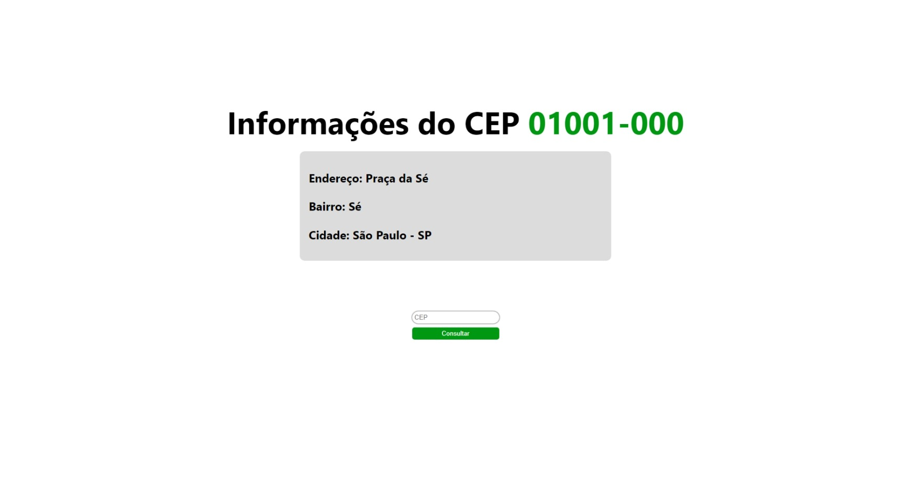

Esse é um projeto feito para a avaliação técnica na [Eureka Labs](https://eurekalabs.com.br/). Consiste num site que consulta informações relacionadas à um CEP, sendo integrado com o [ViaCEP](https://viacep.com.br/).

 

## Instruções de Instalação

#### Requerimentos

- Node
- Docker

Crie um arquivo `.env` baseado no `.env.example` na raíz do projeto e altere a variável `POSTGRES_PASSWORD` para qual você desejar, pois iremos subir um container no docker com o banco de dados. 😊

Em seguida, dê os seguintes comandos:

```
npm install
npm run db:up
npm run dev
```

## Tecnologias


